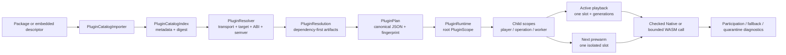

# Vesper Plugin Runtime Contract

The plugin runtime turns verified metadata into bounded, correlated capability
use. Current source and tests remain authoritative when this bundled snapshot
and the checkout differ.

## Safety Rule

Catalog values are metadata only. An immutable `PluginPlan` is the only input to
runtime activation, and every active call is bound to a scope, workload policy,
and correlation generation. No catalog, plan, or diagnostic projection may
contain a live owner, library handle, worker, queue, callback, or media bytes.

## End-to-End Flow

The importer never opens a dynamic library or instantiates a component. The
resolver never reads artifact bytes. Loading and interface validation happen
after the plan is fixed. Playback authority is granted only to the active slot;
prewarm can prepare state but cannot commit clock, surface, audio, or
participation authority.

## Phase Boundaries

| Phase | Primary types | Allowed state | Failure result |
| --- | --- | --- | --- |
| Catalog import | `PluginArtifactDescriptor`, `PluginCatalogRecord`, `PluginCatalog`, `PluginCatalogIndex` | identity, target, ABI range, capabilities, requirements, provisions, runtime dependencies, resource limits, digest, provenance | typed validation/digest error; previous index remains unchanged |
| Resolution | `PluginResolverPolicy`, `PluginResolver`, `PluginResolution` | deterministic provider choices filtered by explicit transport, target, architecture, ABI, semver, and priority | missing provider, version conflict, identity conflict, dependency cycle, or bounded-search error |
| Plan creation | `PluginPlan`, `PluginPlanPolicy`, `PluginPlanProvider` | canonical catalog projection, requirements, selected providers, dependency-first artifacts, catalog and plan fingerprints | stale, tampered, noncanonical, or projection-mismatch error |
| Runtime activation | `PluginRuntime`, `PluginScope`, loader checked wrappers | live owners and sessions under one immutable plan | load/open failure; no implicit transport substitution |
| Playback attachment | `PluginActivePlaybackCorrelation`, `PluginNextPrewarmCorrelation`, `PluginPlaybackAttachment` | session/item/source/playback generations and one active/one prewarm slot | stale attachment, generation mismatch, slot conflict, or authority violation |
| Settlement | `PluginScopeState`, `PluginScopeCloseReport` | bounded disposer and child cleanup with one total deadline | failed, cancelled, or quarantined terminal state with structured counts |

## Catalog And Index

`PluginArtifactDescriptor` is the author/package projection. It records
`plugin_id`, semantic version, publisher, `Native` or `Wasm` artifact transport,
target, format, architecture, ABI minor range, interface capabilities,
`requires`, `provides`, runtime dependency declarations, resource policy, and
`migration_version`.

`PluginCatalogRecord` adds a safe artifact path, SHA-256 digest, source
provenance (`Package`, `Installed`, `Embedded`, or `Development`), and bounded
redacted diagnostics. `PluginCatalog::from_records` validates limits and unique
identity; its canonical serialization produces a catalog fingerprint.

`PluginCatalogImporter` and `PluginCatalogIndex` are read-only lookup layers.
Batch imports construct and validate a complete candidate before committing it;
one bad or duplicate record cannot partially replace the previous index. A
digest check streams a regular file within the import size bound. The index
never stores executable owners, file descriptors, workers, queues, or media.

## Resolution And Plan

`PluginResolverPolicy` is host input, not plugin metadata. It fixes artifact
transport, target, architecture, ABI major/minor, and deterministic plugin
priorities. `PluginResolver` resolves typed service requirements against the
catalog without opening artifacts and reports typed errors for:

- no catalog or policy candidate;
- incompatible provider versions;
- one plugin identity resolving to conflicting artifacts;
- dependency cycles;
- constraint or search-state limits.

`PluginResolution` exposes selected providers and dependency-first artifacts.
`PluginPlan` snapshots that result together with the complete catalog and policy.
Its canonical JSON includes both `catalog_fingerprint` and `fingerprint`.
`PluginPlan::from_json` recomputes catalog, resolver, projection, ordering, and
plan fingerprints; stale or modified plans are rejected before runtime startup.

The plan is immutable for a runtime lifetime. A catalog or host-policy change
creates a new plan and a new runtime generation; it does not mutate a running
plan in place.

## Runtime And Scope Lifecycle

`PluginRuntime::new(plan)` starts with a root `PluginScope`. Scope kinds are
`Root`, `Player`, `Playback`, `NextPrewarm`, `Operation`, and `Worker`. States
are `Created`, `Starting`, `Running`, `Draining`, `Closed`, `Failed`,
`Cancelled`, and `Quarantined`.

Child and owner registrations are bounded by explicit depth, child, owner, and
runtime-lifetime limits. Owner disposers execute outside scope locks. Close,
fail, and cancel share one total deadline across descendants and owners. A
panic, timeout, worker failure, or disposal error is recorded as a quarantine
entry; terminal cleanup remains idempotent and never pretends that a quarantined
resource was released.

The runtime coordinates the plan and scope lifecycle. It is not a replacement
for the loader's executable registry. Native dynamic libraries remain
process-live; the loader does not call `dlclose`.

## Playback Slots And Correlation

The runtime exposes exactly one active playback slot and one next-item prewarm
slot. Correlations carry:

- immutable plan fingerprint;
- session generation;
- item identity;
- source revision;
- active playback generation where applicable.

Attachment tokens are runtime-local, non-zero, and checked against the current
slot. Seek, source replacement, stop, promotion, cancellation, and disposal
advance or invalidate the relevant generation. A stale token or mismatched plan
is rejected and cannot mutate current playback state.

`MasterClock`, `VideoSurface`, `AudioSink`, and `Participation` are active-only
authorities. `PluginPlaybackAuthority` calls from `NextPrewarm` fail with a
typed `NextPrewarmCannotCommit` error. Promotion validates the item, source,
session, and generation before settling the old active scope and changing the
slot role. Replacement settles obsolete prewarm first; failed settlement
records quarantine and does not silently reuse stale attachments.

## Transport And Workload Policy

`PluginTransport` has only `Native` and `Wasm`; there is no `Auto`. Transport is
an explicit identity property and cannot be inferred from `plugin_kind`.
`PluginInvocationPolicy::standard()` validates a separate workload enum:

| Workload | Native | WASM |
| --- | --- | --- |
| `RealtimeMedia` | permitted when the capability and host route support it | rejected by policy |
| `Observer` | permitted | permitted with bounded component limits |
| `Offline` | permitted | permitted with bounded component limits |

The host reports policy rejection as distinct from missing plugin, failed load,
unsupported capability, fallback, and participation. It never silently retries
the same request through the other transport.

WASM uses Wasmtime Component Model and `wasm32-wasip2`. The current component
surface is `PipelineEventHook` and `BenchmarkSink`; no media bytes, PCM, native
frames, files, network, DRM, environment, process, clock, or random access
cross the boundary. Memory, fuel, call deadlines, output bytes, and event
queues are bounded. Trap, timeout, or close failure quarantines that component.

## Audio And Frame Workloads

`AudioProcessor` is a Native realtime PCM extension. Its safe SDK types are
`AudioProcessorPluginFactory`, `AudioProcessorSession`, `AudioPlaybackPolicy`,
`AudioProcessorCapabilities`, and `AudioProcessorChain`. The chain has ordered
processors, a bounded pending queue (maximum 256 frames), backpressure, flush,
and idempotent close.

`AudioPlaybackPolicy` requires a finite positive `playback_rate` and carries
`AudioPitchMode::PreservePitch` or `AudioPitchMode::FollowRate`. A processor
advertises accepted/output PCM formats, rate bounds, pitch modes, flush support,
and in-flight limits. `PreservePitch` and `FollowRate` are different contracts;
the former preserves pitch while changing speed, while the latter allows pitch
to follow bounded resampling. The host owns PTS, discontinuity, clock,
scheduling, and A/V timing. A processor must return plugin-owned PCM while
preserving the input `pts_us` and discontinuity marker; mutation is an ABI
violation.

Native `FrameProcessor` transforms `NativeFrame -> NativeFrame` and remains an
experimental SDK-managed native-frame lane. `NativeDecoder` and both
`SourceNormalizer` families are also experimental. They require explicit frame
or resource ownership, bounded queues, flush/close behavior, fallback policy,
and host evidence before product claims expand.

## Diagnostics And Failure

Diagnostics use separate stages: cataloged, imported, resolved, planned,
found, loaded, interface-validated, selected, opened, participated, bypassed,
fallback, rejected, failed, and quarantined. A short host projection carries
the stage, plugin identity, transport, interface, workload, plan/session/item
generation, and fallback reason. Verbose loader details remain structured and
redacted.

Failure handling follows these rules:

- malformed metadata or digest mismatch leaves the previous catalog intact;
- plan fingerprint or projection mismatch prevents activation;
- ABI panic, unknown status, truncated output, lease violation, or invalid
  timestamps poisons the instance; only cleanup may run afterward;
- queue overflow reports backpressure or bounded drop according to the owning
  contract;
- timeout, cancellation, and close are terminally observable and idempotent;
- quarantine is a containment result, not proof of successful resource release;
- fallback is explicit and never changes transport without a new policy decision.

## Evidence Boundary

The following evidence levels are distinct:

1. source types, tests, or a module exist in the checkout;
2. local build, package, signature, catalog, and install verification pass;
3. a clean external consumer builds from hosted Android coordinates or remote
   SwiftPM products;
4. a signed final application installs and exercises the route on a supported
   physical device or receiver.

Level 1 or 2 cannot establish mobile playback participation, subjective audio
quality, DRM behavior, external Cast/DLNA/AirPlay playback, or publication
availability. Android Media3 and iOS AVPlayer direct routes remain the
production mobile playback paths. A Native AudioProcessor, FrameProcessor,
Decoder, or packet/resource normalizer must be labeled optional or experimental
until the corresponding host route and evidence exist.
