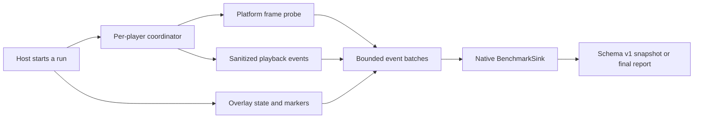

# Performance Diagnostics Contract

Vesper's optional performance diagnostics plugin aggregates bounded UI frame
samples and native playback pressure signals for one player session. Reports
describe correlation between host-overlay activity and frame pressure. They do
not attribute causality to the overlay, player, decoder, network, or media.

The core player packages expose the session API and a lazy coordinator. The
native `vesper_performance_diagnostics` binary ships only in the optional
Android, Apple, and Flutter artifacts.

## Runtime Flow



`start` activates one run without recreating the player. `snapshot` flushes
events through the existing `BenchmarkSink` ABI and leaves the run active.
`stop` removes probes, drains the worker, and caches the final report. Repeated
`stop` calls for the same run return that cached report. Player disposal stops
an active run automatically.

No timing callback, native probe, timer, worker, or diagnostics queue exists
before a run starts. A player permits at most one active run, including the
legacy creation-time `VesperBenchmarkConfiguration.enabled` run.

## Session APIs

The public type names are equivalent across Dart, Kotlin, and Swift. Dart uses
`VesperPerformanceDiagnosticsSession` as the facade:

```dart
final session = await controller.startPerformanceDiagnostics(
  configuration: const VesperPerformanceDiagnosticsConfiguration(),
);
await session.updateOverlayState(
  const VesperPerformanceOverlayState(active: true),
);
await session.recordMarker('ab.overlay_on', sequenceIndex: 1);
final live = await session.snapshot();
final report = await session.stop();
```

Kotlin and Swift controllers expose the same start, overlay-state, marker,
snapshot, and stop operations. Native Android defaults to `androidFrameMetrics`
and native iOS defaults to `iosDisplayLink`. Flutter uses
`flutterFrameTiming` on both platforms.

`VesperPerformanceDiagnosticsConfiguration` defaults to
`includeRawEvents = false` and `maxRawEvents = 256`. `maxRawEvents` accepts
`0...2048`. Raw events consume no storage when disabled.

Marker names contain 1 to 64 ASCII bytes. The first byte is an ASCII letter or
underscore; remaining bytes may also contain digits, period, and hyphen. One
run accepts at most 64 markers. Marker numeric values must be finite.

`VesperPerformanceOverlayState` contains:

| Field | Meaning |
| --- | --- |
| `active` | Whether the measured overlay is actively drawing |
| `sampleClass` | `steady`, `transition`, or `excluded` |
| `loadedBasicItemCount` | Optional nonnegative basic-item count |
| `loadedAdvancedItemCount` | Optional nonnegative advanced-item count |
| `advancedEffectsActive` | Whether advanced effects are active |

Every frame sample captures the overlay state at the same runtime boundary as
the timing value. The plugin never aligns clocks across Dart and native code.

## Schema v1

All wire durations and timestamps use nanoseconds. Dart, Kotlin, and Swift
provide derived millisecond getters for display only.

```json
{
  "schemaVersion": 1,
  "runId": "...",
  "sessionId": "...",
  "platform": "android",
  "probe": "flutterFrameTiming",
  "durationNs": 0,
  "frameBudgetNs": 16666667,
  "cohorts": {
    "overlayInactive": {},
    "overlayActive": {},
    "transition": {},
    "excluded": {}
  },
  "playback": {},
  "diagnosis": {},
  "acceptedEvents": 0,
  "droppedEvents": 0,
  "rawEventsDropped": 0,
  "diagnostics": [],
  "rawEvents": []
}
```

Each cohort contains `sampleCount`, `jankCount`, `severeJankCount`,
`jankRatio`, `severeJankRatio`, `minLoadNs`, `p50LoadNs`, `p95LoadNs`, and
`maxLoadNs`. The playback summary contains `activeDurationNs`,
`droppedVideoFrames`, `bufferingCount`, `bufferingDurationNs`, and
`stallCount`.

Counts, ratios, and min/max values cover the complete diagnostics run. To keep
memory bounded independently of run duration, p50 and p95 are estimates from a
uniform reservoir of at most 2048 frame loads per cohort, sampled across the
complete run rather than from a trailing time window.

The diagnosis contains `kind`, `confidence`, and `evidenceCodes`. Probe,
diagnosis, confidence, and diagnostic severity are raw-string value objects in
the host APIs. Decoders preserve unknown values and unknown top-level report
fields so newer producers remain inspectable by older tooling.

Raw events, when enabled, contain only the bounded diagnostics event families:

- `performance_frame_sample`
- `performance_overlay_transition`
- `performance_session_context`
- `performance_marker`
- `performance_playback_buffering_start`
- `performance_playback_buffering_end`
- sanitized dropped-frame, first-frame, stall, error-code, and lifecycle events

## Probes

| Probe | Frame load | Playback pressure |
| --- | --- | --- |
| `flutterFrameTiming` | `max(buildDuration, rasterDuration)`; batches at 120 samples or 500 ms | Native platform playback events |
| `androidFrameMetrics` | Android `FrameMetrics.TOTAL_DURATION` | Media3 state, dropped-frame, and stall events |
| `iosDisplayLink` | Missed-vsync intervals from `CADisplayLink` | AVPlayer buffering plus access-log dropped-frame and stall deltas |

The frame probes measure different portions of the rendering pipeline. Reports
retain the probe name and should only be compared when platform, probe, content,
device state, and frame-rate conditions are compatible.

## Diagnosis Rules

A frame whose load exceeds one frame budget is jank. A load above two frame
budgets is severe jank. Both steady on/off cohorts require at least 120 samples;
otherwise the diagnosis is `insufficientEvidence`.

UI pressure exists when either steady cohort has a jank ratio of at least 5%,
or its p95 exceeds one frame budget. Overlay correlation exists when the active
cohort's jank ratio rises by at least 5 percentage points and 1.5 times, or its
p95 rises by at least half a frame budget.

Playback pressure exists when a steady buffering interval or stall lasts at
least 500 ms, or dropped frames reach
`max(3, ceil(active playback minutes * 5))`.

Schema v1 exposes total buffering duration and stall count, while the sink keeps
the steady-only durations internal for classification. A stall count by itself
does not cross the playback-pressure threshold. External analyzers should use
`native_playback_pressure` together with the public playback summary instead of
reclassifying every buffering or stall event as pressure.

The six diagnosis values are:

- `insufficientEvidence`
- `noSignificantPressure`
- `overlayCorrelatedUiPressure`
- `hostUiPressureUncorrelated`
- `playbackPressure`
- `mixedPressure`

Confidence is low for 120 to 299 samples in the smaller steady cohort, medium
for 300 to 599, and high at 600 or more when the run also observed at least two
overlay transitions. Evidence codes describe thresholds observed by the
aggregator; they do not establish a root cause.

## Failure Contract

The stable error codes are `alreadyActive`, `artifactUnavailable`,
`probeUnavailable`, `invalidConfiguration`, `controllerDisposed`,
`protocolViolation`, and `internalFailure`.

Artifact or probe setup failure disposes any recorder, listener, worker, and
queue created during startup. A failed or completed run does not block a later
run. Platform disposal removes the frame probe before player resources are
released.

## Privacy Boundary

The diagnostics path performs no network requests and uploads no data. It does
not read or emit media URLs, request headers, cookies, account data, overlay
text, or raw error messages. Playback errors cross the diagnostics boundary as
bounded codes, categories, and retry flags only. Hosts decide whether to retain
or share a report and must apply their own data-handling policy to host-added
marker names.

## Optional Packaging

Android hosts add
`io.github.umbrella22.vesper:vesper-player-kit-performance-diagnostics` only to
the variants that need diagnostics. `debugImplementation` and
`profileImplementation` keep the native library out of Release packages.

iOS hosts link the SwiftPM product `VesperPlayerPerformanceDiagnostics` or the
`VesperPlayerPerformanceDiagnosticsPlugin` XCFramework only from a helper
target used by Run/Profile configurations. Archive configurations must not link
or embed that product.

Flutter hosts use `vesper_player_performance_diagnostics` when all build modes
may carry the plugin. Apps that require Release exclusion attach the native
Maven and SwiftPM products at the host build-configuration layer and use the
session API from `vesper_player` directly.
