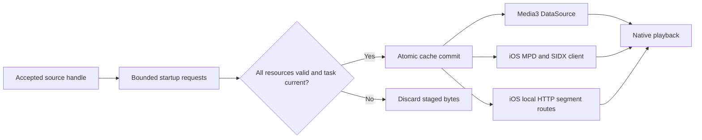

# DASH startup cache

Independent source sessions and playback sequences can warm static, single-period,
unencrypted DASH SegmentBase sources before activation. The native hosts fetch the MPD, SIDX, initialization
range and first media range for one startup audio/video candidate. A new formal
playback session can consume those same bytes. The feature does not retain a
player, decoder, surface or audio output session.

## Activation and reports

Register a descriptor with `VesperSourceSession` and optionally call
`handle.preload()`. The native goal is `dashSegmentBaseStartup`; supported
progressive prefixes use `progressiveRange`. Pass the same handle to ordinary
controller activation or to a playback-sequence item. Native hosts assign cache
scope and revisions; hosts no longer provide cache identities. See the
[source lifecycle and 0.7 migration](source-lifecycle.md) for ownership, APIs,
preload states and explicit navigation.

Rust binds the goal to the source revision, session generation and warmup task
identity. A report using another goal is rejected. Old bridge payloads that
omit the goal continue to mean `progressiveRange`.

`warmupTasks` and `warmupStats` are retained in sequence snapshots on both mobile
hosts and Flutter. `completed` means the entire bounded resource set reached the
cache. It does not mean that a decoder is ready or that a first frame exists.
`cacheHit` describes whether every resource in that warmup was already cached;
byte counters include bytes read from cache. Cache inventory describes the
shared startup cache, not bytes transferred over the network or a playback-hit
ratio. Progressive preloads report `downloadOnly`; their completion does not claim
that the formal player reuses the prefix.

## Formal playback reuse



Android wraps the formal Media3 data source. Adjacent initialization and SIDX
ranges can be assembled into Media3's combined read. A miss continues through
the normal policy-controlled disk cache and upstream data source. Scoped disk
keys also include the source scope and effective request headers.

iOS reuses cached MPD and SIDX responses while creating the DASH-to-HLS session.
Already warmed initialization and first-media ranges become complete segment
URLs on a server bound only to `127.0.0.1`. Their HLS entries omit the original
byte range; HTTP Range and HEAD use offsets relative to the sliced segment.
Subsequent segments retain their original URL and explicit byte range. This
uses AVPlayer's HTTP fMP4 path. Source replacement and disposal explicitly close
the listener, routes, requests and connections.

If a registered iOS resource expires or is evicted before AVPlayer reads it, the
route fetches its original bounded range with the original headers. That fallback
does not repopulate the startup cache or coalesce simultaneous requests. The
listener permits eight connections and eight internal routes, limits headers to
8 KiB, times out a request after twelve seconds, and sends bodies in 64 KiB chunks.

Android prefers AVC video and AAC audio startup candidates, then lower
bandwidth. iOS uses the existing `startupSingleVariant` selection and device
video-decoder capability policy. ABR or explicit track selection can choose a
different representation. Cache completion never guarantees that the selected
playback representation will hit it.

## Bounds and invalidation

Source sessions default to 8 MiB of memory, two physical workers and four pending
preloads. The memory budget may be 0–16 MiB; zero disables preload. Each task's
byte cap defaults to 8 MiB and may be 1 byte–16 MiB. The session budget separately
bounds aggregate staged bytes and resident bytes across its accepted sources.
A task timeout includes queue time. Physical slots and staging reservations
remain occupied until a cancelled or timed-out worker actually exits.
The process-wide cache is capped at 32 MiB and 64 entries. The MPD, initialization
and SIDX requests are each capped at 1 MiB; a first media range is capped at
8 MiB. Player disk-cache policy is independent of this memory preload budget.

Entries live for at most thirty seconds on a monotonic clock and never beyond
the supplied source-expiry time. Each accepted source receives a fresh scope.
Keys include that scope, full resource URL and effective header values. Reusing the same handle preserves its scope across list changes and activation.
A replacement registration, including changed credentials or URLs, cannot reuse
another registration's startup data.
The key digest and task reports do not expose those credentials. Internal cache
clearing invalidates in-flight commits; there is no new public clear-cache API.

Range requests must return the requested interval with HTTP 206, a matching
Content-Range, identity encoding and a complete body. An ignored range, truncated
body, invalid index, unsupported manifest, cancellation or exceeded budget
prevents committing the staged set. Redirects are bounded; startup requests
with supplied headers reject cross-origin redirects. The final MPD response URL
remains the base for relative resources on both cache hits and misses.

Dynamic or multi-period MPDs, SegmentTemplate/List warmup, DRM and player instance
pooling are outside this cache contract. Warmup failure leaves formal playback
available through the host's existing supported route.

A local MPD is a separate manifest input role. Android and iOS preload it through
a bounded file reader (1 MiB maximum), preserve its file URL as the relative
resolution base, and apply accepted HTTP headers to absolute HTTPS media URLs.
Only the manifest loader gains local file access; initialization, index and
media preload range transport remains HTTPS-only. Keep the file available for
normal cold playback and eviction fallback. Removing it after preloading is a
test technique for proving a manifest hit, not an application lifecycle policy.

## Rust integration

`SequenceWarmupGoal` includes `DashSegmentBaseStartup`.
`SequenceResolvedSource` literals specify `warmup_goal`;
`SequenceSourceState::Resolved` patterns can use `..` when the goal is not needed.
`SequenceItem::resolved(...)` defaults to progressive warmup; Rust callers
can use `.with_warmup_goal(SequenceWarmupGoal::DashSegmentBaseStartup)`.
In 0.8, replacing a list or accepting a resolved source does not activate it.
Call `set_active` or navigation explicitly; the optional replacement cursor is
only a scheduling hint.

See [native playback diagnostics](../flutter/vesper_player_platform_interface/doc/playback-diagnostics.md)
for the separate first-frame, audio evidence, decoder probe and suspected-stall
contracts. Startup cache reports must not be treated as those observations.

## Reproducing native delivery checks

`VesperDashStartupDataSourceTest` uses the formal Media3 factory and a counting
HTTP origin under Robolectric. It checks warmed-byte reuse independently of
controller cache policy, credential isolation and normal disk caching of later reads.
`VesperDashStartupTests` checks new iOS session reuse, exact loopback bytes,
segment-local ranges, expiration/clear behavior, budgets and cancellation.

`VesperDashStartupPlaybackDeviceTests` and the test host's
`--dash-startup-smoke` argument run the same physical AVPlayer scenario. The
standalone entrypoint prints a `DASH_STARTUP_SMOKE` JSON record and exits with
zero only after first-frame readiness and progress beyond the warmed segment.
This provides a device-runner option when XCTest cannot establish its IDE
connection. Build and sign `VesperPlayerKitDeviceTestHost`, install it with
`xcrun devicectl device install app`, then launch its bundle identifier with
`--console --terminate-existing` and the smoke argument. It requires no network
access beyond the app's loopback fixture origin and no broad ATS exception.

The committed 64x64, six-second synthetic fixture was generated with:

```sh
ffmpeg -f lavfi -i 'testsrc2=size=64x64:rate=10' -t 6 -an \
  -c:v libx264 -profile:v baseline -pix_fmt yuv420p \
  -g 20 -keyint_min 20 -sc_threshold 0 \
  -movflags frag_keyframe+empty_moov+default_base_moof+global_sidx \
  fixtures/media/dash-startup-video.mp4
```

Tests use the committed fixture's byte offsets. Regenerating with a different
encoder version requires updating those offsets. FFmpeg is a fixture-generation
tool here; it is not part of the production startup-cache path.
