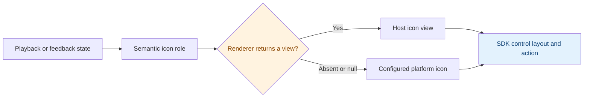

# Stage skins and migration to 0.6.4

The Stage skin API introduced in 0.6.4 applies the same presentation contract to
Flutter `vesper_player_ui`, Android `vesper-player-kit-compose-ui`, and iOS
`VesperPlayerKitUI`. Each UI module provides `VesperPlayerStageSkin`, native
icon rendering, and reusable action buttons. A skin configures the controls
rendered by that UI module; it does not cross Rust, FFI, JNI, or Flutter player
channels.

Flutter applications use the Dart skin even when their playback backend is
Media3 or AVPlayer. Native Compose and SwiftUI hosts use their respective skin
implementations. Platform UI types and image assets remain platform-local.

## Selection and resolution

Every `VesperPlayerStage` accepts an optional `skin` parameter. Omitting it or
passing `null` / `nil` selects a fresh default skin scope for that Stage. A
Stage does not inherit a skin from an outer standalone-control theme. This
makes disabling a host's custom skin explicit and prevents another player on
the same page from changing its appearance.

A host can replace the skin during playback. Keep the controller, surface,
Stage identity, and media source stable while changing this parameter. Skin
changes update presentation without issuing playback commands. Layout changes
can still cancel an in-progress gesture under the existing Stage layout rules.

The skin contains:

| Field | Responsibility |
| --- | --- |
| `icons` | A `VesperPlayerStageIcons` collection of default or replacement font/vector/SF Symbols icons |
| `colors` | A `VesperStageColors` palette for controls, text, timeline, scrims, and HUD |
| `metrics` | `VesperStageMetrics` button roles, spacing, HUD geometry, and timeline geometry |
| `iconBuilder` (Dart/Swift) or `iconContent` (Kotlin) | Optional custom icon views, including images and host-rendered vector assets |

Icon rendering resolves the current action first, then checks the custom
renderer, then uses the configured `icons` entry. A renderer's null / nil
result means fallback. Constructors provide defaults for every field, so a
host can override one icon or one color without restating the entire skin.



`play` represents the action available while paused; `pause` represents the
action available while playing. `fullscreen` enters fullscreen and
`exitFullscreen` leaves it. `navigateBack` follows the host navigation callback.
The remaining roles are `more`, `brightness`, `volume`, and `speed`. Kotlin enum
cases use PascalCase (`Play`, `ExitFullscreen`); Dart and Swift use lower camel
case. Native default icons retain their platform's directionality behavior.
Custom assets must implement any required RTL mirroring.

Strings and action callbacks remain independent of skin selection. Icon views
are decorative: controls supply labels, button semantics, and pointer actions.
Custom renderers should return bounded, synchronous visual content and respect
the supplied size and color. Multicolor assets may retain their own colors.
Flutter SVG packages, Compose painters, and SwiftUI asset loaders remain host
dependencies; the SDK does not download or execute skin code.

## Visual roles and touch targets

`VesperStageButtonVariant` selects a named `VesperStageButtonStyle`. An explicit
button `style` overrides that variant for a standalone or injected action.
Each style has `size`, `iconSize`, `backgroundOpacity`, and `borderRadius`.

| Variant | Usage | Flutter / Android size : icon size | iOS size : icon size |
| --- | --- | --- | --- |
| `standard` | Standalone or host action | 52 : 24 | 52 : 18 |
| `toolbar` | Default menu / matching top-bar action | 38 : 24 | 38 : 22 |
| `navigation` | Back action | 38 : 23 | 38 : 19 |
| `compact` | Compact play / pause | 38 : 24 | 38 : 17 |
| `compactFullscreen` | Compact fullscreen action | 38 : 24 | 38 : 18 |
| `expanded` | Expanded play / pause | 38 : 22 | 38 : 17 |
| `expandedFullscreen` | Expanded fullscreen action | 34 : 19 | 34 : 17 |
| `primary` | Standalone primary play button | 72 : 36 | 72 : 28 |

Sizes use Flutter logical pixels, Android dp, or iOS points. Visual size and
hit area are distinct. Icon buttons reserve at least 48 x 48 logical pixels /
dp on Flutter and Android, and 44 x 44 points on iOS. Small custom styles retain
these targets. Native rows can therefore occupy more space than their earlier
visual frames; check narrow control rows when migrating.

The standard background opacity is 0.10, primary is 0.14, and built-in toolbar
and transport variants are transparent. `borderRadius` defaults to 999 for
rounded controls. The palette's alpha is multiplied by the applicable control
opacity. Widget / View content receives the resolved foreground and icon size;
a generic Compose icon slot receives `LocalContentColor` and a constrained box.
`VesperStageIcon` provides the full resolved style to custom semantic renderers.

Additional metrics are `buttonSpacing` (horizontal control gaps),
`hudIconSize`, `hudBorderRadius`, `timelineTrackHeight`, `timelineThumbSize`
(compact scrubbers), and `timelineLargeThumbSize`. Geometry must be finite;
lengths are positive except spacing and corner radii, which may be zero.
`backgroundOpacity` is in [0, 1]. Constructors enforce these preconditions
(with assertions in Dart). Hosts must choose dimensions that fit their Stage;
the skin API does not introduce automatic responsive layout or control wrapping.

Palette fields are `foreground`, `secondaryForeground`, `background`, `scrim`,
`buttonBackground`, `accent`, `timelineStart`, `timelineEnd`,
`timelineInactive`, `timelineThumb`, `hudBackground`, and `hudForeground`.
Timeline disabled opacity and HUD track opacity are derived from these colors.
Host drawers and sheet content apply their own styling.

## Flutter migration

Import `package:vesper_player_ui/vesper_player_ui.dart`. Stage construction
remains valid without `skin`. Add this parameter alongside existing controller,
snapshot, layout, fullscreen, and callback arguments:

```dart
const brandSkin = VesperPlayerStageSkin(
  icons: VesperPlayerStageIcons(play: Icons.play_circle_outline),
  colors: VesperStageColors(
    foreground: Color(0xFFF0FFF8),
    timelineStart: Color(0xFF31C48D),
    timelineEnd: Color(0xFF74E8B4),
  ),
  metrics: VesperStageMetrics(
    toolbar: VesperStageButtonStyle(size: 38, iconSize: 22, backgroundOpacity: 0),
  ),
);

// Inside VesperPlayerStage(...):
skin: customSkinEnabled ? brandSkin : null,
```

For images or SVG widgets, provide a builder. The following uses Flutter's
asset image support; a host can return its own SVG widget at the same point.
The image must be declared in the host's asset bundle.

```dart
final imageSkin = VesperPlayerStageSkin(
  iconBuilder: (context, role, style) {
    if (role != VesperStageIconRole.play) return null;
    return Image.asset('assets/player/play.png',
      width: style.size, height: style.size, color: style.color);
  },
);
```

### Breaking public button changes

`VesperStageIconButton.icon` now accepts `Widget`, replacing `IconData`.
The `size`, `iconSize`, and `containerAlpha` constructor parameters are replaced
by `variant` and optional `style`. The equivalent mechanical migration is:

```dart
// Before 0.6.4.
VesperStageIconButton(
  icon: Icons.favorite,
  label: 'Favorite',
  size: 38,
  iconSize: 23,
  containerAlpha: 0,
  onPressed: onFavorite,
);

// New API: preserve explicit geometry.
VesperStageIconButton(
  icon: const Icon(Icons.favorite),
  label: 'Favorite',
  style: const VesperStageButtonStyle(
    size: 38, iconSize: 23, backgroundOpacity: 0,
  ),
  onPressed: onFavorite,
);

// New API: follow the active toolbar skin.
VesperStageIconButton(
  icon: const Icon(Icons.favorite),
  label: 'Favorite',
  variant: VesperStageButtonVariant.toolbar,
  onPressed: onFavorite,
);
```

Use `VesperStageIcon(VesperStageIconRole.play)` for a skin-controlled SDK action.
Use `Icon`, an asset widget, or another decorative widget for a host-specific
action. Avoid setting explicit size/color on a child `Icon` when it should
inherit the button style.

`VesperStagePrimaryPlayButton` replaces its `size` and `iconSize` arguments with
`style`; use `VesperStageButtonStyle(size: 72, iconSize: 36,
backgroundOpacity: 0.14)` to preserve an explicit primary appearance. It also
accepts `strings`, so its play/pause accessibility labels can be localized.

Injected widgets in `topBarPrimaryAction`, `topBarSecondaryAction`, and
`expandedControlBarLeading` read the Stage skin automatically. For controls
outside a Stage, wrap them with:

```dart
VesperPlayerStageTheme(
  skin: brandSkin,
  child: VesperStagePrimaryPlayButton(isPlaying: playing, onPressed: togglePause),
);
```

`VesperPlayerStageTheme.of(context)` exposes the active skin to other host
widgets. `VesperStagePillButton`, `VesperStageChip`, and `VesperTimelineScrubber`
also read that scope. The theme supplies a default `IconTheme` for standalone
icons; individual SDK buttons apply their resolved icon size and color within
that scope. Explicit chip accents remain host-selected.

Tests that locate a decorative icon should tap its containing button or its
semantic label. Decorative icon content is excluded from hit testing and
accessibility; an icon's presence alone no longer identifies a hit-test node.

## Android Compose migration

Use the types in `io.github.umbrella22.vesper.player.android.compose.ui`.
The Stage adds `skin: VesperPlayerStageSkin? = null`; existing source calls can
omit it. Recompile hosts against the new AAR: adding Kotlin default parameters
changes generated JVM method signatures, so previously compiled consumers must
not mix old and new UI artifacts.

```kotlin
val brandSkin = VesperPlayerStageSkin(
    icons = VesperPlayerStageIcons(play = Icons.Rounded.PlayCircle),
    colors = VesperStageColors(timelineStart = Color(0xFF31C48D), timelineEnd = Color(0xFF74E8B4)),
)
// Inside VesperPlayerStage(...):
skin = if (customSkinEnabled) brandSkin else null,
```

`iconContent` selects optional composable content for each role. Returning null
uses the configured `ImageVector`. This keeps painter loading in composition:

```kotlin
val imageSkin = VesperPlayerStageSkin(iconContent = { role ->
    if (role == VesperStageIconRole.Play) {
        { style ->
            Icon(
                painter = painterResource(R.drawable.player_play),
                contentDescription = null,
                modifier = Modifier.size(style.size),
                tint = style.color,
            )
        }
    } else null
})
```

The public `VesperStageIconButton` and `VesperStagePrimaryPlayButton` share the
same variant/skin resolution as built-ins. The former takes a composable icon
slot and a required accessibility label:

```kotlin
VesperStageIconButton(
    label = "Favorite",
    variant = VesperStageButtonVariant.Toolbar,
    onClick = onFavorite,
) {
    Icon(Icons.Rounded.Favorite, contentDescription = null)
}
```

For standalone controls, use `VesperPlayerStageTheme(skin = brandSkin) { ... }`.
Host content can read `LocalVesperPlayerStageSkin.current`. UI configuration
belongs in the Compose UI module, not in controller, source, or JNI DTOs.

## iOS SwiftUI migration

Import `VesperPlayerKitUI`. Pass `skin: customSkinEnabled ? brandSkin : nil`
alongside existing Stage arguments. Rebuild consumers with the matching UI
framework / Swift package; the Stage initializer gained a parameter and binary
compatibility with a UI consumer compiled against 0.6.3 or earlier is not promised.

```swift
let brandSkin = VesperPlayerStageSkin(
    icons: VesperPlayerStageIcons(play: "play.circle.fill"),
    colors: VesperStageColors(timelineStart: .mint, timelineEnd: .green)
)

let imageSkin = VesperPlayerStageSkin(iconBuilder: { role, style in
    guard role == .play else { return nil }
    return AnyView(
        Image("PlayerPlay")
            .resizable()
            .renderingMode(.template)
            .foregroundStyle(style.color)
            .frame(width: style.size, height: style.size)
    )
})
```

The asset belongs in the host's asset catalog; specify its bundle when it lives
in a separate resource package. SF Symbols names remain supported through
`VesperPlayerStageIcons`. The builder is evaluated on the main actor.

```swift
VesperStageIconButton(label: "Favorite", variant: .toolbar, action: onFavorite) {
    Image(systemName: "heart.fill")
}
.vesperPlayerStageSkin(brandSkin)

VesperStagePrimaryPlayButton(isPlaying: playing, action: togglePause)
    .vesperPlayerStageSkin(brandSkin)
```

Custom host controls can read `@Environment(\.vesperPlayerStageSkin)`. The
modifier scopes standalone controls; apply the Stage's `skin` argument to
configure an entire Stage. `VesperStagePrimaryPlayButton` accepts an optional
`label` override for host-localized copy. Skin selection does not localize text.

## Integration boundaries and validation

The skin covers Dart/Compose/SwiftUI Stage controls, timeline, feedback HUD, and
public buttons. It does not restyle system Picture in Picture, Android media
notifications, lock-screen controls, or the native AirPlay route picker. Their
platform-specific configuration remains independent. Disabling a custom skin
restores default UI; hiding or replacing controls is a separate integration.

The three example Stage wrappers forward `skin` to their SDK Stage. Preserve
host state and pass the selected skin through wrappers when moving between
inline and fullscreen presentations. Reusing one configuration value does not
require recreating the controller or surface.

Regression checks cover default fallback, partial overrides, custom view
rendering, both control layouts, play/pause and fullscreen transitions, HUD,
minimum hit areas, and switching skins while retaining the playback surface.
Run Flutter package tests, Android Compose instrumentation on a device or
emulator, and `VesperPlayerKitUITests` on an iOS Simulator. The iOS
`VesperPlayerKitUIInteractionTests` scheme exercises actual touches, button
accessibility nodes, HUD input, and surface retention with an inert test surface.
It supports Simulator and signed device execution. Compilation alone does not
establish input behavior, and accessibility-tree assertions do not replace
manual VoiceOver acceptance.
