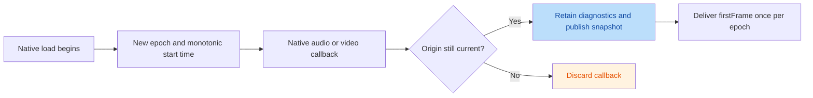

# Native playback diagnostics

`VesperPlayerSnapshot.playbackDiagnostics` retains audio input evidence and the
first native video observation for the current load attempt. These observations
are available on the Android Media3 and iOS AVPlayer routes without enabling
benchmark capture or installing a diagnostics plugin. Unsupported hosts omit the
snapshot, which Dart represents as `null`.



## Load identity and observation lifecycle

`playbackEpoch` is local to one controller. Zero means no load attempt has
started. Source replacement invalidates the old observations immediately; each
native load attempt, including retries and same-URI reloads, starts with empty
audio evidence and no first-frame observation. Epochs can have gaps and are not
application source IDs or track IDs.

Callbacks are checked against their originating native player/load. iOS also
checks the player item and surface when delivering queued readiness callbacks.
Disposal rejects subsequent observations. Failure teardown can retain the last
snapshot for diagnosis; a new load clears it.

Flutter publishes the snapshot before its corresponding
`VesperPlayerFirstFrameEvent`. An event is delivered at most once per controller
epoch. If the EventChannel has no listener at observation time, the latest
retained first frame is delivered after the snapshot when listening resumes.
Observations from an attempt superseded during that gap are discarded. Late
application subscribers read the retained snapshot; the public event stream
does not replay events that were already delivered.

## First-frame meaning

| Field | Meaning |
| --- | --- |
| `playbackEpoch` | Native load attempt that produced this observation |
| `elapsedSinceLoadStartMs` | Native monotonic duration from load preparation to the observation |
| `mediaPositionMs` | Optional position in the media timeline at observation time |
| `kind` | Platform observation point, including preserved future wire values |

Android reports `media3RenderedFirstFrame` from Media3's rendered-first-frame
callback. iOS reports `avPlayerLayerReadyForDisplay` when the attached
`AVPlayerLayer` becomes ready for display. Layer readiness does not prove that
the application's visible UI has painted the video. A hidden prewarm surface
can produce native video evidence before the user opens the player.

Elapsed duration includes native source preparation and waiting for the native
observation, including delays from a missing surface or paused playback. It
excludes application URL resolution and request orchestration. It is independent
of media position: resuming at 90 seconds can produce an observation at
`elapsedSinceLoadStartMs: 120` and `mediaPositionMs: 90000`. Applications measure
tap-to-frame latency on their own clock and associate it with the intended
source attempt; absolute monotonic timestamps are not exchanged between Dart
and native clocks.

Audio-only playback may never produce a first-frame observation. Neither
`playing`, an advancing position, decoder initialization, nor a timeout creates
a synthetic first frame.

## Audio evidence

`audio` contains optional `trackId`, `formatId`, `codec`, `sampleMimeType`,
`decoderName`, `channels`, and `sampleRate`, plus an `evidence` value and optional
`lastIssue`. Unknown fields remain null.

| Evidence | Platform source |
| --- | --- |
| `runtimeFormat` | Media3 audio input format callback; decoder identity is updated separately |
| `selectedMediaOption` | AVPlayer's current selected audio media option mapped to its catalog ID |
| `manifestMetadata` | AVPlayer selected option with codec/channel/rate fields from the DASH catalog |
| `unknown` | No supported observation currently identifies the audio input |

Track IDs remain opaque SDK catalog identifiers. Requested audio selection does
not establish the effective selection. iOS leaves decoder identity, MIME type,
and unexposed runtime format fields unknown. Manifest metadata does not prove a
decoder was created. Decoder identity and format evidence do not prove that
samples reached an audio output device.

Media3 decoder/sink error callbacks update `audio.lastIssue` and emit
`VesperPlayerWarningEvent` with `warning.domain == VesperRuntimeWarningDomain.audio`.
The typed `warning.audio` value contains its originating `playbackEpoch` and
captured audio diagnostics. These callbacks can be recoverable and do not
themselves change the player's terminal error category or trigger a retry.
`lastIssue` retains the most recent issue through format changes and audio
disable within the attempt; only one issue is retained. `platformCode` currently
identifies the native exception class on Android.

Terminal native playback failures include `details.playbackDiagnostics` as
captured context. Dart exposes it through `VesperPlayerError.playbackDiagnostics`.
The iOS native error's string-valued details contain JSON at that key, with the
same typed getter on `VesperPlayerError`; the Flutter adapter converts it into a
nested map. A generic AVPlayer failure with audio context remains a generic
playback failure. AVPlayer currently supplies no independent audio sink-error
observation in this API.

This contract does not observe speaker output progress or select a recovery
policy. Device testing remains necessary to associate a stall with a particular
audio format or decoder.

## Suspected playback stalls

`lastStall` retains at most one `VesperPlaybackStallObservation` per native load
attempt. A `VesperPlayerWarningEvent` with `domain: playback` carries the same
observation through `warning.playback`. The retained snapshot is published first;
Dart rejects warnings from a superseded epoch. An iOS EventChannel subscriber
can receive the current retained warning if it was not previously delivered.
This is historical evidence, not a claim that playback remains stalled.

Native timers sample independently of media-time observers every second. Detection
requires observed forward media progress. Initial startup, pause, stop, seeking,
interruption/suppression, terminal errors and invalid positions do not count.
Seek completion and rate changes reset the observation window. A backwards media
position or a sampling gap over three seconds also requires fresh progress, so
suspension and main-thread delays do not immediately produce a warning.

The default `VesperPlaybackStallPolicy` reports `positionNotAdvancing` after five
seconds or `bufferingTimeout` after fifteen seconds. Configure positive thresholds
or disable observations using `controller.setPlaybackStallPolicy(policy)`.
The observation includes monotonic elapsed duration, media position and the
captured audio diagnostics. It does not assert that an audio decoder or sink
caused the stall. Audio-only playback can be observed, but silent output while
the media clock advances cannot be detected by this API. Observations currently
apply to native system playback, not experimental native-frame pipelines.

## Independent audio decoder capability probe

`VesperPlayerController.probeAudioDecoderCapability(request)` is independent of
the video/HDR capability probe. Supply the original codec string, sample MIME,
channel count and sample rate when known. Results retain the request, resolved
MIME, evidence, reason and decoder candidates; unknown status values survive
Dart forwarding through `statusRawValue`.

Android queries the same default MediaCodec audio candidates used by the native
player, including software audio decoders. It checks sample rate and channel
limits, Media3 format acceptance, and explicit platform profile evidence for
profile-bearing codecs. Missing profile evidence, incomplete constraints,
unrecognized codecs, conflicting MIME/codec metadata and query failures yield
`unknown`. `unsupported` requires a complete request with no candidates or
known format rejection by every candidate. Raw PCM remains `unknown` because
its playback route may bypass MediaCodec.

iOS returns `unknown`, evidence `unavailable`, and reason
`avPlayerAudioDecoderQueryUnavailable`: AVPlayer exposes no equivalent public
full-format decoder query. Older Flutter MethodChannel hosts return
`unknown/platformProbeNotImplemented` when the method is absent.

A `supported` result is decoder-format evidence only. It does not establish
container, manifest, DRM, network, output-route or audible-output support. It
must not remove device-specific compatibility rules or automatically select a
recovery policy.

## Application use

```dart
final subscription = controller.events.listen((event) {
  if (event is VesperPlayerFirstFrameEvent) {
    final firstFrame = event.observation;
    recordStartup(
      firstFrame.playbackEpoch,
      firstFrame.elapsedSinceLoadStartMs,
      firstFrame.kindRawValue ?? firstFrame.kind.name,
    );
  } else if (event is VesperPlayerWarningEvent && event.warning.audio != null) {
    recordAudioIssue(event.warning.audio!);
  }
});

final retained = controller.snapshot.playbackDiagnostics;
// Cancel the subscription when its application owner is disposed.
```

Native Android hosts read `controller.playbackDiagnostics` as a `StateFlow`, or
register `setOnPlaybackDiagnosticsChangedListener` on the main thread for
synchronous, ordered publications. The listener immediately receives the current
snapshot. Native iOS hosts read `controller.playbackDiagnostics` and subscribe
to `controller.playbackDiagnosticsPublisher` on the main actor. The dedicated
publisher carries the current value immediately; it is independent of the
controller's general `objectWillChange` stream.

Dart retains unknown observation, issue, and evidence names in raw-value fields.
Swift Codable diagnostic string wrappers also preserve unknown names. Required
wire epochs and durations cannot be missing, fractional, or negative; invalid
observations fail decoding instead of becoming zero-duration successes. Older
hosts remain compatible by omitting `playbackDiagnostics` entirely.
