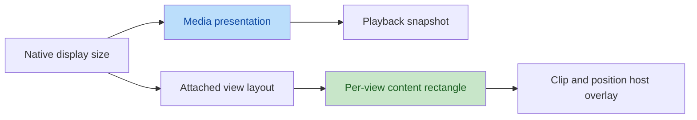
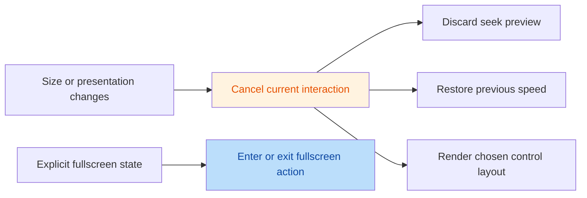

# Video presentation and portrait playback

Mobile system playback preserves the video's display aspect ratio and centers
the picture inside the surface. Unused space is black: Android SurfaceView and
TextureView use aspect fit; iOS AVPlayerLayer uses `resizeAspect`. The application
selects surface size, screen orientation, fullscreen policy, and overlay layout.

## Media dimensions and view geometry

`VesperPlayerSnapshot.videoPresentation` reports native display width and height
after rotation and pixel aspect correction. `displayAspectRatio` is width divided
by height. Android uses Media3 VideoSize; iOS uses AVPlayerItem.presentationSize.
These values are separate from declared track catalog dimensions and raw
`videoVariantObservation` evidence. Unknown media dimensions are null.

Each playback view publishes its own `VesperVideoSurfaceGeometry`, with view
width, height, and `contentRect`. Geometry is **not stored in the playback
snapshot**: one controller can outlive several view instances during fullscreen
transitions. The old view cannot publish the replacement view's geometry.

| Surface | Media dimensions | View geometry |
| --- | --- | --- |
| Flutter | `snapshot.videoPresentation` | `VesperPlayerView.onGeometryChanged` or `VesperPlayerStage.onGeometryChanged` |
| Android | `controller.videoPresentation` StateFlow | `VesperPlayerSurfaceView.geometry` StateFlow, `onGeometryChanged`, or Compose surface/Stage callback |
| iOS | `controller.videoPresentation` and `videoPresentationPublisher` | `PlayerSurfaceView.geometry`, `onGeometryChanged`, or `PlayerSurfaceContainer` callback |

Coordinates start at the view's top left and use logical pixels in Flutter, dp
on Android, and points on iOS. `contentRect` excludes renderer-added black bars;
bars encoded in the video remain part of the picture. Native-frame experimental
routes do not claim this system-renderer geometry contract.

Geometry updates when native presentation size, window attachment, or layout
changes. A null value means unknown, detached, or not yet laid out. Source
replacement clears old media dimensions and geometry. Surface detachment clears
view geometry while known media dimensions can remain. Stopping a loaded source
retains its known dimensions. No synthetic 16:9 rectangle is reported while size
is unknown. Flutter disposes subscriptions without invoking host callbacks from
a disposed widget; hosts discard their cached geometry when removing that view.



Overlays clip to `contentRect` and subtract its origin from Stage coordinates
before mapping into their content canvas. Flutter `onContentTap` continues to
report complete Stage coordinates, including black bars. For example:

```dart
VesperVideoSurfaceGeometry? geometry;

VesperPlayerStage(
  controller: controller,
  snapshot: snapshot,
  controlLayout: VesperStageControlLayout.compact,
  isFullscreen: isFullscreen,
  onGeometryChanged: (value) => setState(() => geometry = value),
  onContentTap: (position) {
    final rect = geometry?.contentRect;
    if (rect == null || !rect.contains(position.dx, position.dy)) return false;
    return hitTestContent(
      (position.dx - rect.left) / rect.width,
      (position.dy - rect.top) / rect.height,
    );
  },
  onOpenSheet: openSheet,
  onToggleFullscreen: toggleFullscreen,
)
```

The viewport API still describes screen visibility and preload hints. It is not
an alternative source of video content geometry.

## Control migration in 0.6.0

Control density and fullscreen state are separate required inputs on all three
UI surfaces. Compact controls can be used in portrait fullscreen; expanded
controls can be used in a wide embedded player. Fullscreen icons and labels
always reflect `isFullscreen`. The Stage does not set OS orientation or resize
its host. Hosts provide safe-area layout for their chosen fullscreen container.

| Previous API | 0.6.0 API |
| --- | --- |
| Flutter/Compose `isPortrait` | Required `controlLayout` and `isFullscreen` |
| SwiftUI `isCompactLayout` | Required `controlLayout`; retain explicit `isFullscreen` |
| `landscapeControlBarLeading` | `expandedControlBarLeading` |

Use `VesperStageControlLayout.compact` / `.expanded` in Dart and Swift,
`VesperStageControlLayout.Compact` / `.Expanded` in Kotlin. Select control density
from available space and product requirements, independently of screen mode.

Gestures retain the Stage coordinate system: horizontal dragging seeks; left
and right vertical dragging adjusts brightness and volume; long press temporarily
uses 2x playback. Size, control-layout, and fullscreen changes cancel pending
seeks and restore temporary playback speed. Cancellation never commits a seek.
Buttons and the reserved control area keep priority over Stage gestures.



## Picture in Picture

Android PiP selects an explicit preferred ratio, native display ratio, viewport
ratio, host ratio, then 16:9. Ratios outside the platform interval are clamped
without rounding beyond its limits. Media, view geometry, and viewport changes
refresh system parameters for manual and automatic entry. The content rectangle
also supplies the transition source rectangle when available.

One session owns the Activity's PiP parameters and events. The last enabled
configuration selects the owner while PiP is inactive; another session cannot
replace an entering or active owner. Failed entry requests preserve the previous
owner. iOS AVPlayerLayer PiP uses the system's media presentation;
`preferredAspectRatio` is an Android hint, not an iOS window-size override.

## Verification boundary

Unit and widget regressions cover display dimensions, pixel aspect correction,
unknown values, geometry subscription disposal, fullscreen actions, gesture
cancellation, PiP ratio priority, boundary rounding, and multiple sessions.
Native lifecycle tests cover surface replacement and geometry invalidation.

Physical-device portrait/rotated media, HDR output, and system PiP animations
require device acceptance. Simulator compilation and widget rendering do not
establish hardware-rendering or system-PiP acceptance.
